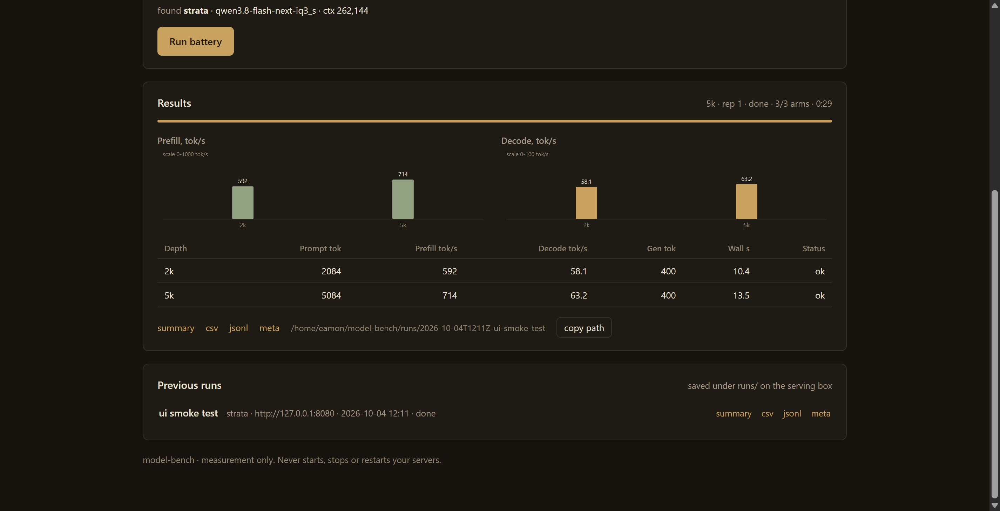

# Local-AI-Speed-Test-Harness

Custom harness to test local LLMs prefill and decode speeds at all context depths.

**Model Bench** is the tool in this repo: point it at any local model server, hit Run, and get
prefill and decode tok/s at fixed prompt depths on the same battery every time, plus a record you
can hand straight to a charting pass.



## What it does

- Sends one request per prompt depth (default: 20k, 60k, 100k, 150k, 200k, 250k tokens).
- Reads prefill and decode speed from the server's own `timings` object - no client-side stopwatch for backends that report them.
- Always the same conditions: fixed corpus slices cut to exact token counts, a unique tag per request (no prefix-cache reuse), a discarded warm-up, temp 0.5 / seed 12345.
- Never starts, stops or restarts your servers. It only measures what is already serving.

## Supported backends (auto-detected)

| Backend | Detected by | Measurement |
|---|---|---|
| llama.cpp (llama-server) | `/props` with `build_info` | `POST /completion` - `timings`, `ignore_eos`, `cache_prompt: false` |
| Strata | `/v1/models` items carrying `status`/`meta` | `POST /v1/chat/completions` - `timings` + MTP draft counters |
| Any OpenAI-compatible | fallback | `POST /v1/chat/completions` - server `timings` if present, else client SSE timing (marked approximate) |

## Run it

```bash
./scripts/run.sh     # starts the UI on :8090 (detached), log in runs/server.log
# open http://<box-ip>:8090
./scripts/stop.sh
```

No dependencies - Python 3.10+ standard library only.

On box `.5`, `run.sh` picks up `/home/eamon/Strata/.venv/bin/python` automatically so the tool can use
the Strata pack tokenizer for exact prompt slicing. Anywhere else it falls back gracefully
(llama.cpp `/tokenize`, then a char-ratio estimate - actual token counts are always read back from
the response and recorded).

## The battery

- Depths: **20k / 60k / 100k / 150k / 200k / 250k** tokens (Quick: 20k + 150k; Custom: free choice).
- Prompts: six Project Gutenberg books (`corpus/`), sliced to the target token count; the same depth
  always uses the same book. Each request carries a unique `[rXXXXXX]` tag so no two prompts share a prefix.
- Gen: 400 tokens (configurable) · temperature 0.5 · seed 12345.
- Sampler discipline: llama.cpp requests leave sampler parameters alone (the server inherits from model
  metadata); Strata requests pin the sweep-baseline sampler (top_k 20 / top_p 0.95 / min_p 0) so runs stay
  comparable with the earlier sweep data.
- A depth that does not fit the server's context (ctx − gen − 512) is skipped and recorded as a row.

## Output

Each run writes `runs/<timestamp>-<label>/`:

- `results.jsonl` - one self-describing JSON row per request: depth, book, prompt tokens, prefill tok/s,
  decode tok/s, draft counters, per-GPU VRAM/temps, wall time, errors.
- `summary.md` - readable table + peaks.
- `summary.csv` - same data, one row per arm, for charts.
- `meta.json` - endpoint, detected backend/model/ctx, battery config, host, GPU list.

All four are linked in the UI and served at `/runs/<id>/<file>`.

## CLI mode

```bash
python3 bench.py --url http://127.0.0.1:8080 --label "Strata base IQ3_S"
python3 bench.py --url http://127.0.0.1:8080 --battery quick --gen 256 --reps 2
python3 bench.py --url http://127.0.0.1:8080 --depths 20k,100k --out /tmp/smoke
```

## Notes

- Corpus texts are Project Gutenberg public-domain files.
- `runs/` is gitignored - measurement data does not go into this repo.
- The tool is read-only towards model servers: no model loads, no config edits, no restarts.
